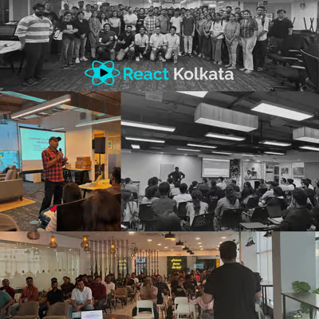

# 🚀 React Kolkata

> The comprehensive Next.js starter and toolkit for building modern, scalable web apps with best practices, rapid setup, and a vibrant community.

---



Welcome to **React Kolkata**! This project provides a robust foundation for Next.js applications, featuring TypeScript, Tailwind CSS, i18n, testing, and more. Whether you're building a personal project or a production-grade app, React Kolkata helps you get started quickly and maintain code quality with ease.

**Join our community events:** [React Kolkata on lu.ma](https://lu.ma/reactkolkata)

## ✨ Features

- **Next.js 15+**: Modern, server-rendered React apps
- **TypeScript**: Static typing for safer, scalable code
- **Tailwind CSS**: Utility-first, rapid UI development
- **ESLint & Prettier**: Code quality and consistent formatting
- **Prettier Plugins**: Tailwind class sorting & import sorting
- **Husky**: Pre-commit hooks for code quality
- **Docker Support**: Easy containerization and deployment
- **Internationalization (i18n)**: Built-in multi-language support with next-intl
- **Playwright & Vitest**: E2E, unit, and integration testing
- **Community Events**: [React Kolkata on lu.ma](https://lu.ma/reactkolkata)

---

## 🚦 Quick Start

### 1. Create a New Project

```bash
npx create-next-app -e https://github.com/reactplay/react-kolkata.git my-app
cd my-app
```

### 2. Install Dependencies

```bash
pnpm install # or npm install or yarn install
```

### 3. Start the Development Server

```bash
pnpm dev # or npm run dev or yarn dev
```

Visit [http://localhost:3000](http://localhost:3000) to view your app.

### 4. Docker (Optional)

To run the app in Docker:

```bash
docker-compose up
```

---

## 🌍 Internationalization (i18n)

Built-in support for multiple languages using [next-intl](https://next-intl-docs.vercel.app/).

- Route-based locale handling: `/[locale]/`
- Easy translation hooks: `useTranslations` in server/client components
- Translation files: `src/config/i18n/content/`

Example:

```js
import { useTranslations } from "next-intl";

const t = useTranslations("Home");
<h1>{t("welcomeMessage")}</h1>;
```

**Add a new language:**

1. Add a JSON file in `src/config/i18n/content/` (e.g., `es.json`)
2. Add the language code to the `locales` array in `src/config/i18n/navigation.ts`

#### How to add a new language support:

To add a new language, we have to add the language JSON file to the content directory, which is in the root directory, that is our first step.

After that, we have to add the newly added language to the locales array in the navigation.ts file. Below is the content of the navigation.ts file, where we need to add the newly added language to the locales array:

```bash
import {defineRouting} from 'next-intl/routing';
import {createNavigation} from 'next-intl/navigation';

export const routing = defineRouting({
  // A list of all locales that are supported
  locales: ['en', 'fr', 'newLanguage'], // Add the new language code here

  // Used when no locale matches
  defaultLocale: 'en'
});

export const {Link, redirect, usePathname, useRouter, getPathname} =
  createNavigation(routing);
```

#### Using Strings from Language Files

To use strings from a language file in both **client and server** components, use the `useTranslations` hook.

#### Steps:

1. **Import `useTranslations`:**

   ```javascript
   import { useTranslations } from "next-intl";
   ```

2. **Initialize useTranslations with a section:**
   ```javascript
   const t = useTranslations("Home");
   ```
3. **Fetch and use translations:**

   ```javascript
   <h1>{t("welcomeMessage")}</h1>
   ```

## 🧪 Testing

### Playwright (E2E)

- Headless & UI browser testing (Chromium, Firefox, WebKit)
- Test location: `__test__/e2e/`
- Config: `playwright.config.ts`

Run tests:

```bash
pnpm test:e2e # or npm run test:e2e
```

### Vitest (Unit & Integration)

- Fast, parallel test runner with JSDOM
- Config: `vitest.config.mts`

Run tests:

```bash
pnpm test # or npm run test
```

---

## 📁 Folder Structure

```bash
.
├── __test__           # All tests (e2e, unit, integration)
├── public             # Static assets (images, icons, etc.)
├── src                # Main source code
│   ├── app            # Next.js app directory
│   ├── base           # Base styles, constants, data
│   ├── components     # UI, common, custom components
│   ├── config         # i18n and other configs
│   ├── lib            # Utilities and shared logic
│   ├── modules        # Feature modules/sections
│   └── ...            # More folders (see code)
├── styles             # Global and component styles
├── types              # TypeScript type definitions
```

---

****test****: All tests (e2e, unit, integration)
**public**: Static assets (images, icons, etc.)
**src/components**: UI, common, and custom components
**src/modules**: Feature modules/sections
**src/config**: Config files (i18n, etc.)
**src/base**: Base styles, constants, and data
**src/lib**: Shared utilities and logic
**styles**: Global and component styles
**types**: TypeScript type definitions

## 📝 Conventions

- **Folders/files**: kebab-case (e.g., `my-folder`)
- **Functions/variables**: camelCase (e.g., `filterProductsByType`)
- **Constants**: UPPERCASE (e.g., `MAX_VALUE`)
- **Component names**: PascalCase (e.g., `Footer`)
- **Types**: `.d.ts` extension
- **Hooks**: camelCase, start with `use` (e.g., `useFetchData`)
- **UI components**: in `ui/` folder, each as its own folder with `index.ts`

## 🤝 Contributing

Contributions are always welcome!

See [CONTRIBUTING.md](CONTRIBUTING.md) for ways to get started.

Please adhere to this project's [CODE_OF_CONDUCT.md](CODE_OF_CONDUCT.md).

## 🙏 Acknowledgements

- [Next.js](https://nextjs.org/)
- [Tailwind CSS](https://tailwindcss.com/)
- [Playwright](https://playwright.dev/)
- [Vitest](https://vitest.dev/)
- [lu.ma Events](https://lu.ma/reactkolkata)

---

## 📸 Screenshots

<p align="center">
  
  
</p>

---

For more, join our [React Kolkata lu.ma](https://lu.ma/reactkolkata) community!
